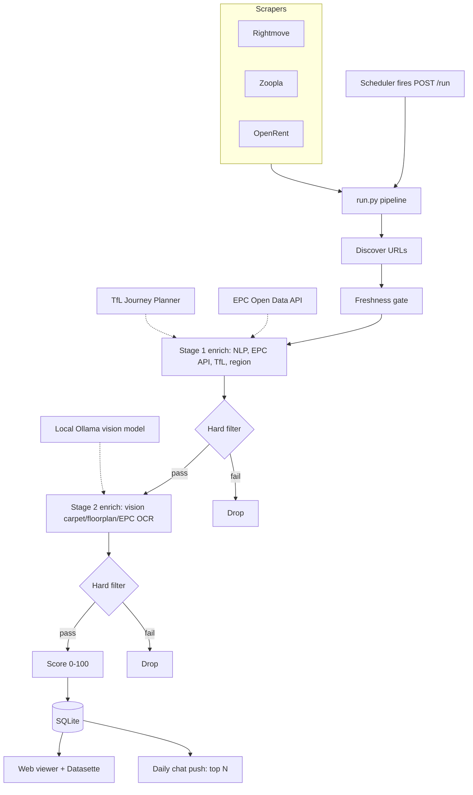

# London Rental Engine

A self-hosted rental-search engine for London. It scrapes the major property
portals daily, enriches every listing with the signals that actually decide a
flat (commute time, EPC rating, carpet detection, garden, bills, deposit), scores
each one against your weighted preferences, and surfaces a curated shortlist
instead of the hundreds of near-identical listings the portal UIs show you.

The premise is *revealed preference*. Hand-tuned scoring weights are guesses;
your rankings on real listings are data. You rank the shortlist by hand, the
system learns what you actually value from those rankings, and the next run's
selection reflects it. The goal is to converge on a scoring function that matches
your taste within a few weeks, then run as a near-zero-effort filter from then on.

> Status: this began as a personal flat-hunt during a London move. The move is
> done. The engine is being released so others can self-host their own. It is a
> working homelab tool, not a hosted product. Expect to read code and edit YAML.

## What it does

1. **Discovers** new listings from Rightmove, Zoopla, and OpenRent for your search
   profile (areas, bed count, price cap).
2. **Freshness-gates** each URL so already-seen listings are cheaply touched, not
   re-scraped.
3. **Enriches** in two stages, cheap signals first:
   - *Stage 1 (cheap):* HTML scrape, regex feature extraction (garden, balcony,
     bills, furnished, parking, pets, council tax, deposit), EPC rating via the UK
     Open Data Communities API, public-transport commute time via TfL, nearest
     station + walk time + travel zone.
   - *Hard filter* between stages so expensive vision compute is only spent on
     listings that already pass the cheap-signal gate.
   - *Stage 2 (expensive):* floorplan vision, two-signal carpet detection, and EPC
     certificate OCR, all via a local Ollama vision model.
4. **Scores** each listing 0 to 100 against weighted criteria.
5. **Surfaces** results two ways: a web viewer (FastAPI) for inspection and a
   daily push of the top N listings to a chat channel.

## Architecture

```
                          +-------------------+
        schedule (cron) -> |  POST /run        |   FastAPI app (uvicorn)
                          |  viewer + API     |   serves the web UI
                          +---------+---------+
                                    |
                                    v
+-----------+      +----------------------------------------------+
| Scrapers  | ---> |                run.py pipeline               |
| rightmove |      |  discover -> freshness gate                  |
| zoopla    |      |     -> stage 1 enrich (NLP/EPC/TfL/region)   |
| openrent  |      |     -> HARD FILTER                           |
+-----------+      |     -> stage 2 enrich (vision)              |
                   |     -> HARD FILTER -> score -> save          |
                   +----------------+-----------------------------+
                                    |
        +---------------------------+---------------------------+
        v                           v                           v
+---------------+        +-------------------+        +-------------------+
| EPC Open Data |        | TfL Journey       |        | Local Ollama      |
| Communities   |        | Planner API       |        | vision model      |
| (HTTP API)    |        | (HTTP API)        |        | (carpet/floorplan)|
+---------------+        +-------------------+        +-------------------+
                                    |
                                    v
                          +-------------------+
                          |  SQLite (homehunt)|
                          +---------+---------+
                                    |
                         +----------+----------+
                         v                     v
                  +-------------+      +-----------------+
                  | Web viewer  |      | Daily chat push |
                  | + Datasette |      | (top N listings)|
                  +-------------+      +-----------------+
```



## How it works

### The two-stage enrichment

Vision inference is the expensive step. Running a vision model over every photo of
every listing is wasteful when most listings fail on a cheap signal first (over
budget, wrong zone, EPC below your floor). So enrichment is split: cheap text and
API signals run first, a hard filter drops the obvious failures, and only the
survivors reach the vision stage. The hard filter runs again after vision because
vision can reveal a disqualifying fact (a floor area below your minimum, an EPC
rating worse than the listing claimed).

### Revealed-preference scoring

Each listing gets a 0 to 100 score from weighted criteria. The seed weights live in
`filter-scoring-config.yaml`. When you rank a shortlist by hand, a weight updater
turns those pairwise preferences into an updated weight vector (ridge-regularised)
and writes it to the database. The runtime reads the latest learned weights and
falls back to the YAML seed when none exist yet.

### Vision signals (and why carpet)

The vision stage exists to filter on things you would otherwise have to judge by
eye, one listing at a time, from the photos: the features that are obvious in an
image but absent from the structured data. The built-in example is **carpet
detection**, two independent signals (carpet in the bedroom, carpet elsewhere)
read from listing photos by a local vision model.

Carpet is a *personal* choice. Finding a home with no carpets mattered to the
author, so it is the signal that ships. It is not meant to be universal. The
point of the vision stage is the pattern, not this one feature: point the model
at whatever you spend time eyeballing in photos and wish you could filter
mechanically. Examples you might swap in or add: wall type and finish, floor to
ceiling windows, natural light, kitchen condition, flooring material, ceiling
height, the state of the bathroom. The prompt and the signal it returns live in
`homehunt/carpet.py` (and `homehunt/floorplan_vision.py` for floorplans); copy
that shape to add your own.

Whatever signal you use, validate the model by eye on a sample before you let it
carry weight in scoring. Small vision models are confidently wrong often enough
that an unvalidated signal is worse than none.

## Personalise before you run

This started as one person's flat-hunt, so several choices are baked to the
author's taste. They are not defaults you should keep; they are the things to
change first. Each one is called out here explicitly.

| Personal choice | Where it lives | What to change it to |
|---|---|---|
| **Commute destinations.** Journey times are scored against specific anchors (the author's workplaces). This is specific and almost certainly wrong for you. | `TFL_DESTINATION` env var; commute logic in `homehunt/tfl.py` | Your own destination(s). Change the anchor before the commute score means anything. |
| **Carpet as the vision signal.** Ships because the author wanted a carpet-free home. | `homehunt/carpet.py` | Swap or extend with the visual feature that matters to you (see *Vision signals* above). |
| **Search area, bed count, budget.** The example targets specific North/East London boroughs, 1 to 2 beds, under a set monthly cap. | `london-search.yaml` (copy the `.example.yaml`) | Your boroughs, bed count, and price cap. Re-run `scripts/resolve_region_ids.py` after editing areas. |
| **Scoring weights and hard filters.** The seed weights and thresholds (EPC floor, minimum floor area, zone limits) reflect the author's priorities. | `filter-scoring-config.yaml` (copy the `.example.yaml`) | Your thresholds. The learned weights then adapt to your rankings over time. |
| **Portals enabled.** Defaults to all three UK portals. | `ENABLED_PORTALS` env var | The portals relevant to your market. |

If you change nothing else, change the commute destination and the search
profile. Those two make the scores meaningful for your search rather than the
author's.

## Components

| Component | Where | Purpose |
|---|---|---|
| Pipeline entry point | `run.py` | Discover, enrich, score, save (one command) |
| Core package | `homehunt/` | Scrapers, enrichers, scorer, API |
| Scrapers | `homehunt/scrapers/` | Per-portal discovery and extraction |
| Hard filter | `homehunt/filters.py` | Cheap-signal gate between stages |
| Scorer | `homehunt/scorer.py` | Weighted 0 to 100 scoring |
| EPC enrichment | `homehunt/epc.py`, `epc_vision.py` | Rating via API, OCR fallback |
| Transit enrichment | `homehunt/tfl.py` | Commute time, nearest station, zone |
| Vision | `homehunt/carpet.py`, `floorplan_vision.py` | Local Ollama inference |
| Web app | `homehunt/api.py` | FastAPI viewer + `/run` trigger |
| Search profile | `london-search.yaml` | Areas, bed count, price cap, region IDs |
| Filters + scoring config | `filter-scoring-config.yaml` | Hard-filter thresholds, scoring curves |

## Setup

### 1. Prerequisites

What: install the runtime dependencies.
Why: the pipeline needs Python 3.11+, and the vision stage needs a local Ollama
with a vision model pulled.

```bash
# Python deps
python3.11 -m venv .venv
source .venv/bin/activate
pip install -r requirements.txt

# Local vision model (Ollama)
ollama pull qwen3-vl:2b-instruct-q8_0   # or any vision model you prefer
```

Success looks like: `python -c "import homehunt"` returns nothing (no import
error) and `ollama list` shows the vision model.

### 2. Get API keys

What: register for the two free public APIs.
Why: EPC ratings and commute times come from external data sources.

- **EPC Open Data Communities** (free): https://epc.opendatacommunities.org/
  provides `EPC_EMAIL` and `EPC_API_KEY`.
- **TfL** (free): https://api-portal.tfl.gov.uk/ provides `TFL_APP_KEY`.

Success looks like: you have both keys.

### 3. Configure secrets

What: create an env file the pipeline can read.
Why: keys must never live in the repo.

```bash
cp .env.example .env   # then fill in the values below
```

```ini
EPC_EMAIL=you@example.com
EPC_API_KEY=...
TFL_APP_KEY=...
TFL_DESTINATION=Old Street Station, London   # your commute anchor
OLLAMA_URL=http://127.0.0.1:11434
VISION_MODEL=qwen3-vl:2b-instruct-q8_0
ENABLED_PORTALS=rightmove,zoopla,openrent
ALERT_THRESHOLD=60
```

Success looks like: `.env` exists and is listed in `.gitignore`.

### 4. Define your search

What: edit `london-search.yaml` with your areas, bed count, and budget.
Why: this is the single source of truth for what gets scraped.

Region IDs in the YAML are populated only by `scripts/resolve_region_ids.py`, never
by hand. Run it after you set your area names.

Success looks like: the YAML has resolved region IDs for every area you listed.

### 5. Run the pipeline

What: run one full pass.
Why: confirm the end-to-end flow works before scheduling it.

```bash
python run.py
```

Success looks like: rows written to the SQLite db and a top-N summary printed.

### 6. View results

What: start the web app.
Why: inspect, filter, and rank listings.

```bash
python -m uvicorn homehunt.api:app --host 127.0.0.1 --port 8000
# then open http://127.0.0.1:8000/viewer
```

Success looks like: the viewer lists your scored listings.

### 7. Schedule it (optional)

What: fire `POST /run` on a schedule.
Why: a daily or periodic run keeps the shortlist fresh with zero effort.

Any scheduler works (cron, launchd, a workflow tool). Point it at
`POST http://<host>:8000/run`. Keep the app running as a service so the endpoint
is always up.

Success looks like: a fresh run appears in the viewer on schedule.

## Configuration reference

All behaviour is controlled by environment variables and two YAML files.

| Variable | Default | Purpose |
|---|---|---|
| `EPC_EMAIL`, `EPC_API_KEY` | none | EPC Open Data Communities auth |
| `TFL_APP_KEY` | none | TfL Journey Planner auth |
| `TFL_DESTINATION` | none | Commute anchor for journey times |
| `OLLAMA_URL` | `http://127.0.0.1:11434` | Local vision model endpoint |
| `VISION_MODEL` | see `.env.example` | Vision model name |
| `ENABLED_PORTALS` | `rightmove,zoopla,openrent` | Which scrapers to run |
| `ALERT_THRESHOLD` | `60` | Min score for the daily push |
| `FRESHNESS_HOURS` | `23` | Re-scrape horizon |
| `HOMEHUNT_DB` | `data/homehunt.db` | SQLite path |
| `HOMEHUNT_CONFIG` | `london-search.yaml` | Search profile path |

See `filter-scoring-config.yaml` for hard-filter thresholds and scoring curves.

## Notes and limitations

- Scrapers depend on portal HTML and APIs that change without notice. When a portal
  changes shape, the matching scraper in `homehunt/scrapers/` needs updating.
- This is a self-hosted personal tool. There is no auth on the web app. Bind it to
  `127.0.0.1` or put it behind your own network controls. Do not expose it publicly.
- Respect each portal's terms of service and rate limits. The scrapers are tuned for
  low-volume personal use.

## License

See `LICENSE`.
